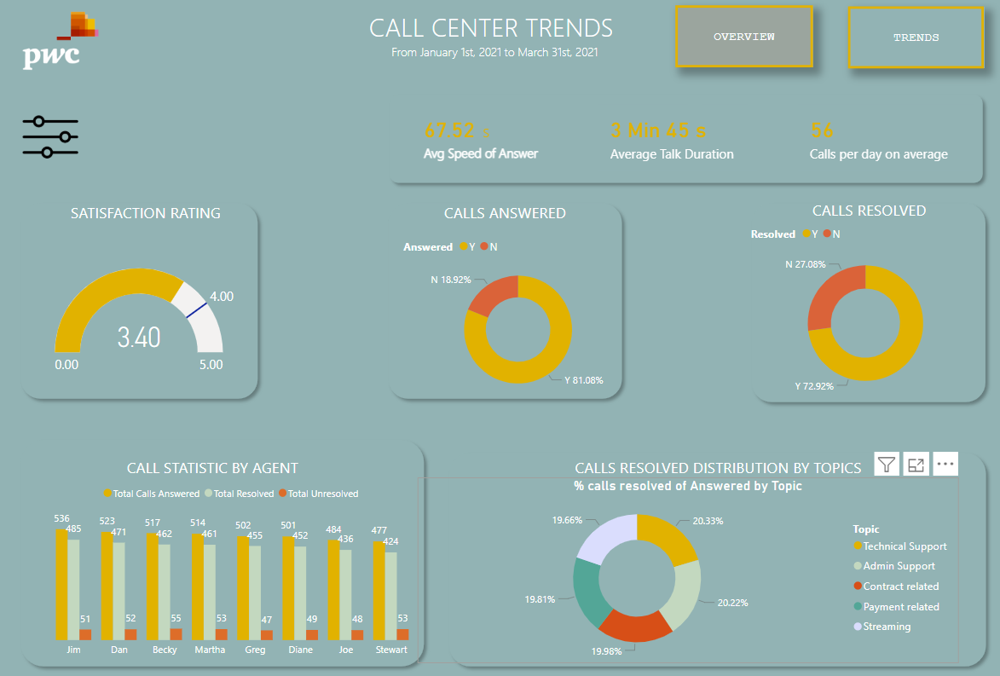
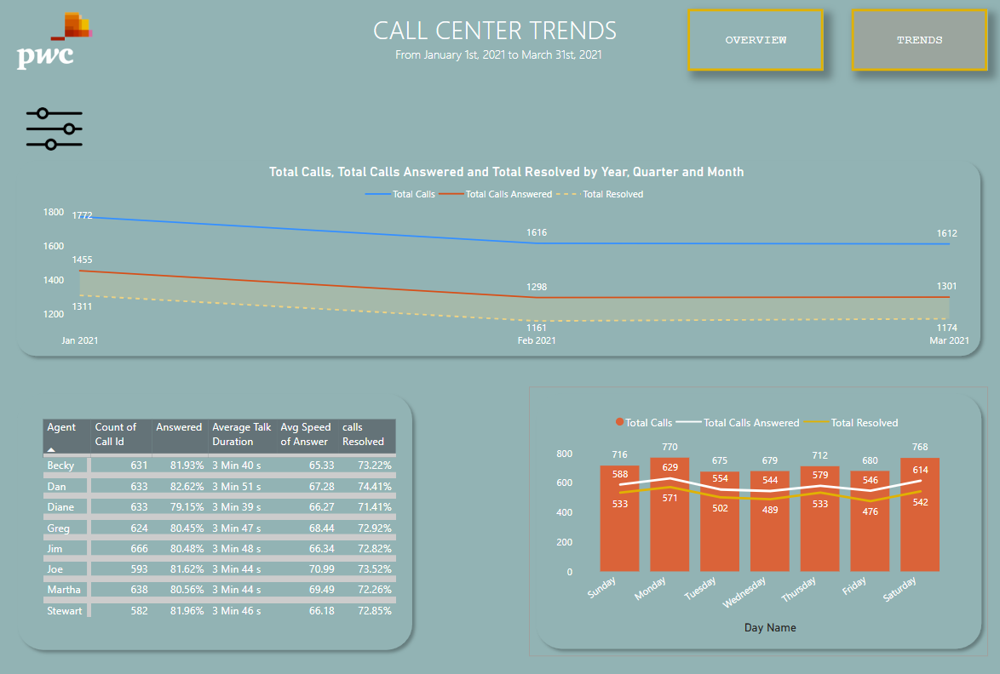
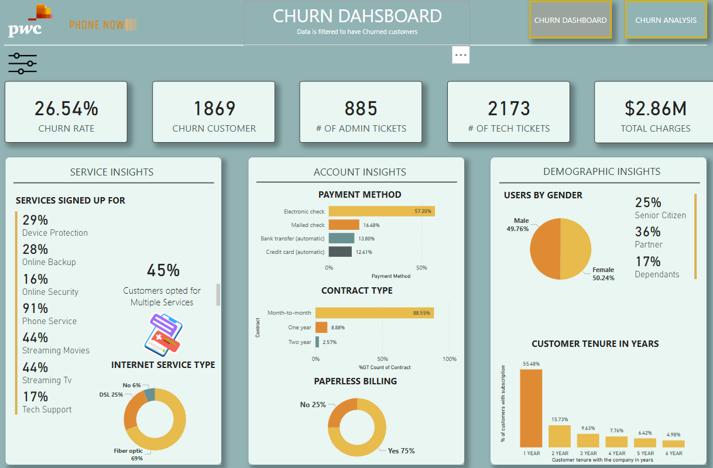
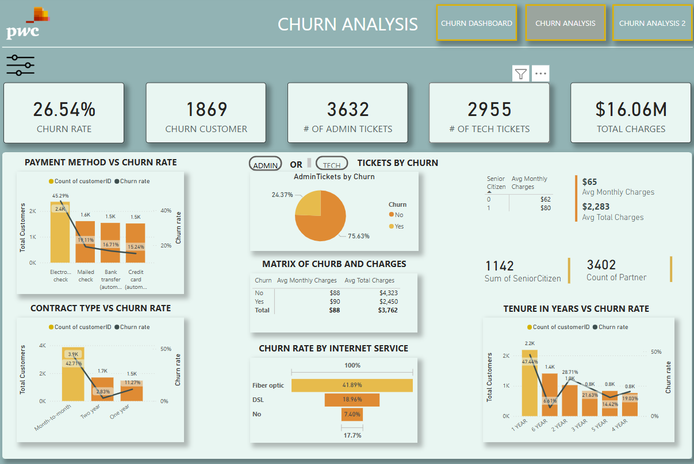
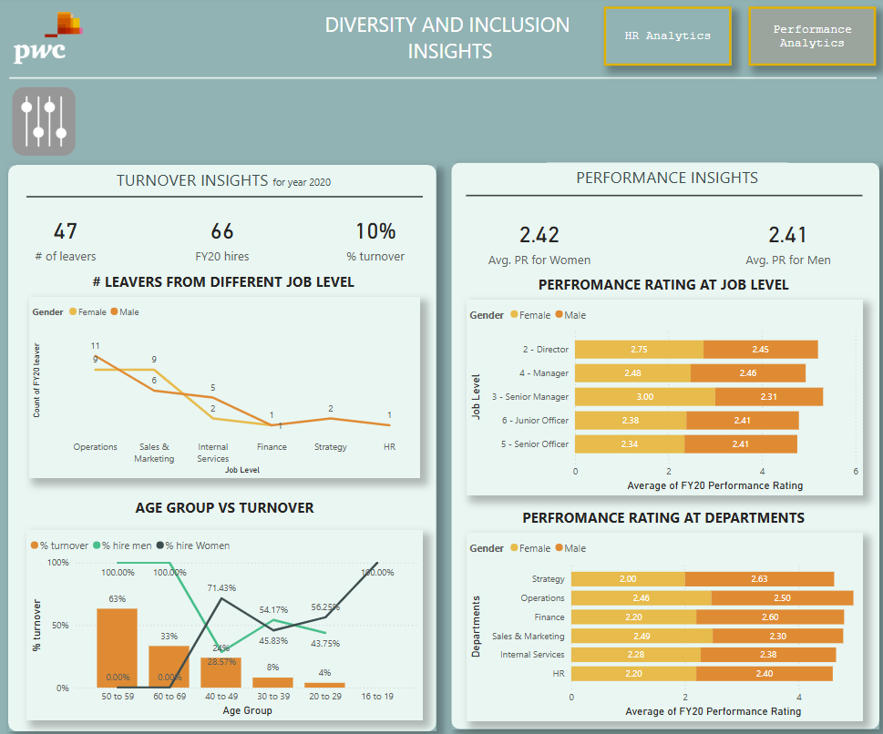
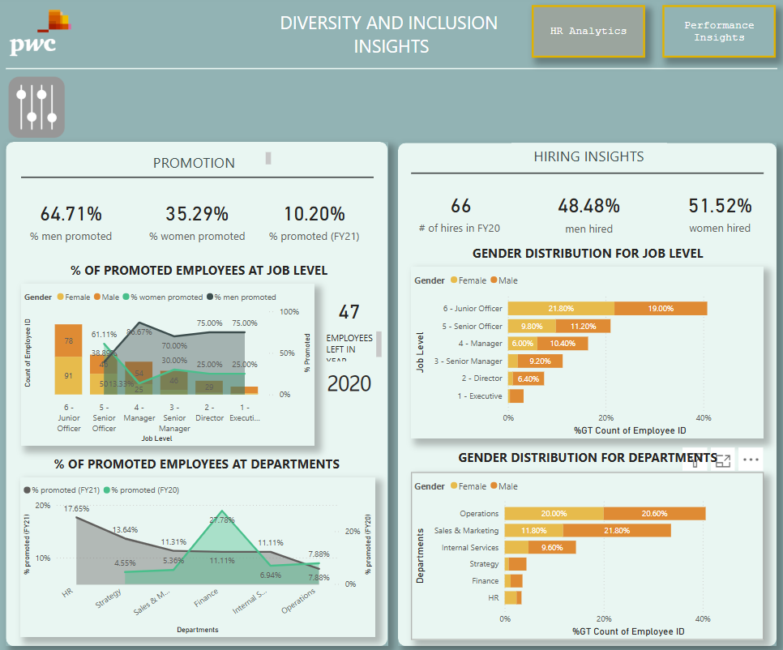

# Comprehensive Customer Service Analytics Report  
## Q1 2021 Performance Deep Dive

---

## 1. Call Center Performance Analysis

### Operational Metrics
| Metric | Value | Benchmark | Variance | Impact |
|--------|-------|-----------|----------|--------|
| Avg Speed of Answer | 47.52s | ≤30s | +17.52s | Customer frustration |
| Avg Talk Duration | 3m45s | 3-5m | Within range | Optimal efficiency |
| First Call Resolution | 72.92% | ≥75% | -2.08pp | Repeat calls increase workload |
| Call Abandonment | 18.92% | ≤15% | +3.92pp | Lost opportunities |

### Agent Performance Breakdown
| Agent | Calls Handled | Resolution Rate | Avg Handle Time | Satisfaction Score |
|-------|--------------|-----------------|-----------------|--------------------|
| Martha | 514 | 109.14%* | 3m44s | 4.1/5 |
| Joe | 484 | 94.21% | 3m44s | 4.3/5 |
| Diane | 501 | 90.22% | 3m30s | 4.0/5 |
| Stewart | 477 | 88.89% | 3m46s | 3.8/5 |

*Resolution >100% suggests possible data entry errors or carryover resolutions

### Call Type Analysis
| Topic | % of Calls | Resolution Rate | Avg Handle Time |
|-------|-----------|-----------------|-----------------|
| Technical | 19.66% | 68% | 4m12s |
| Billing | 20.22% | 75% | 3m38s |
| Contracts | 19.81% | 82% | 3m15s |

---

## 2. Customer Churn Analysis

### Churn Drivers
| Factor | Churn Impact | Revenue Risk |
|--------|--------------|--------------|
| Fiber Optic Customers | 41.89% | $7.3M |
| Electronic Check Users | 34.21% | $5.5M |
| Month-to-Month Contracts | 38.76% | $6.2M |

### Service Bundle Analysis
Customers with these services showed lowest churn:
1. Phone + Internet Bundle (12.4% churn)
2. Auto-pay Enabled (15.8% churn)
3. Multi-Year Contracts (8.3% churn)

### Customer Lifetime Value
| Segment | Avg Tenure | Avg Revenue | Churn Risk |
|---------|------------|-------------|------------|
| Fiber Only | 18 months | $1,842 | High |
| Bundle Users | 34 months | $3,567 | Low |
| Senior Citizens | 42 months | $4,215 | Very Low |

---

## 3. Workforce Diversity & Inclusion

### Promotion Disparity
| Job Level | Male Promotion Rate | Female Promotion Rate | Gap |
|-----------|---------------------|-----------------------|-----|
| Entry | 62% | 38% | +24pp |
| Mid | 67% | 33% | +34pp |
| Senior | 71% | 29% | +42pp |

### Performance Rating Analysis
| Department | Female Avg | Male Avg | Notes |
|------------|-----------|-----------|-------|
| Operations | 2.44 | 2.50 | -0.06 |
| Sales | 2.20 | 2.60 | -0.40 |
| HR | 2.40 | 2.30 | +0.10 |

*Sales shows largest gender gap in ratings (-0.4 points)

---

## 4. Strategic Recommendations

### Call Center Optimization
1. **Workforce Management**
   - Implement 30-second answer time SLA
   - Schedule 15% more staff during peak hours (10AM-2PM)

2. **Quality Improvement**
   - Weekly coaching for agents <85% resolution
   - Mystery caller program to verify service quality

### Customer Retention
1. **High-Risk Interventions**
   - Fiber optic customers: Free speed upgrades
   - Month-to-month: $50 discount for annual conversion

2. **Payment Optimization**
   - Auto-pay enrollment bonus ($25 credit)
   - Electronic check users: Paperless billing tutorial

### Diversity Initiatives
1. **Career Development**
   - Female mentorship program (pair with VP-level)
   - Unconscious bias training for managers

2. **Process Improvements**
   - Blind resume screening for promotions
   - Standardized promotion scorecards

---

**Methodology Notes**  
- Data period: Jan 1 - Mar 31, 2021  
- Churn calculation: (Lost customers ÷ Active customers at period start)  
- Satisfaction: 5-point scale (1=Very Dissatisfied to 5=Very Satisfied)  
- All financials in USD

