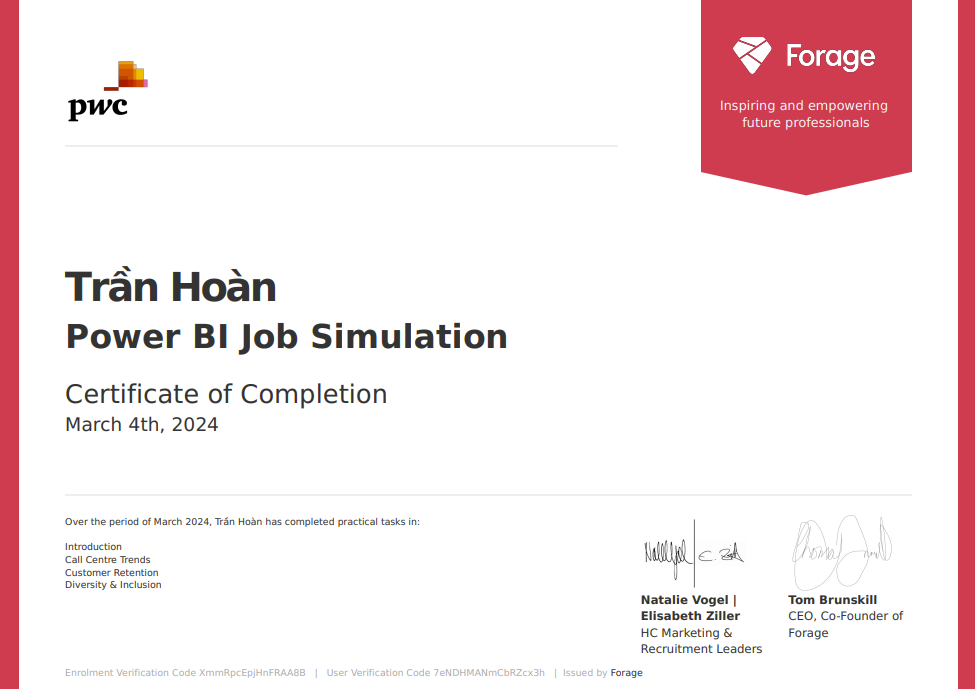
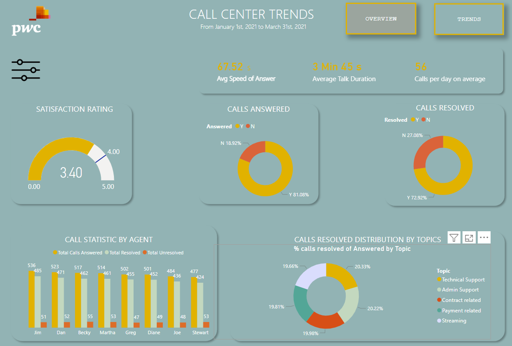
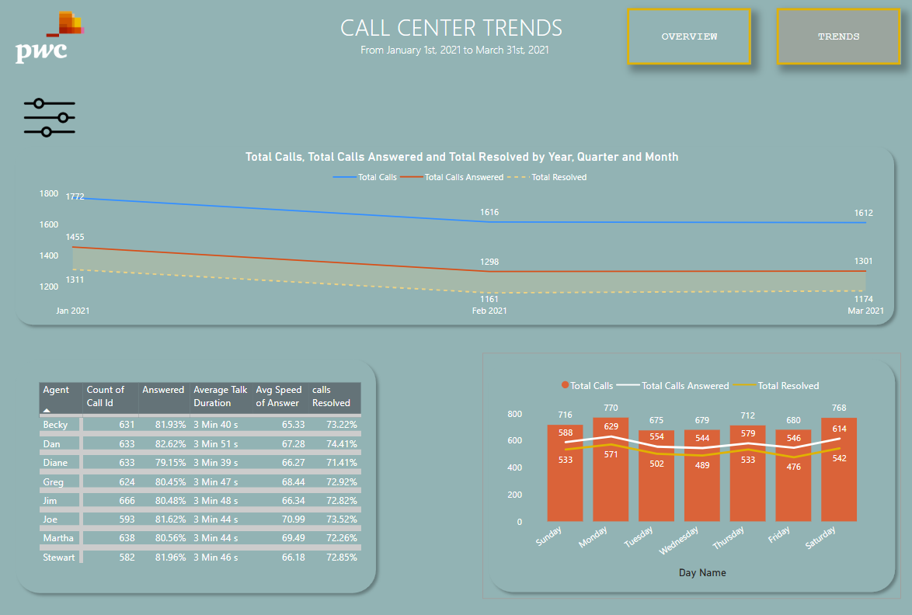
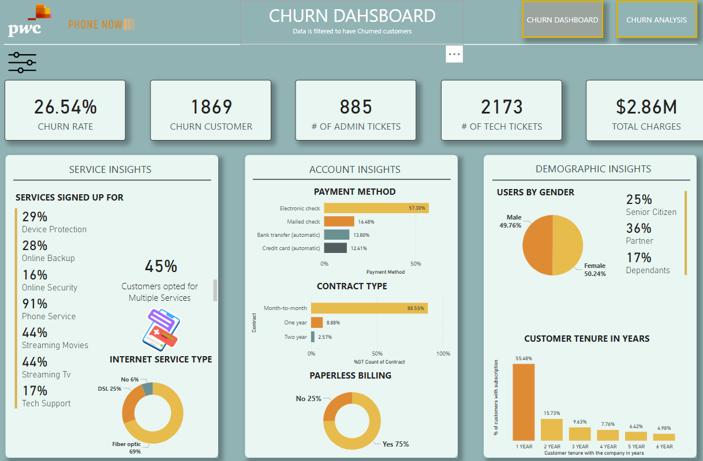
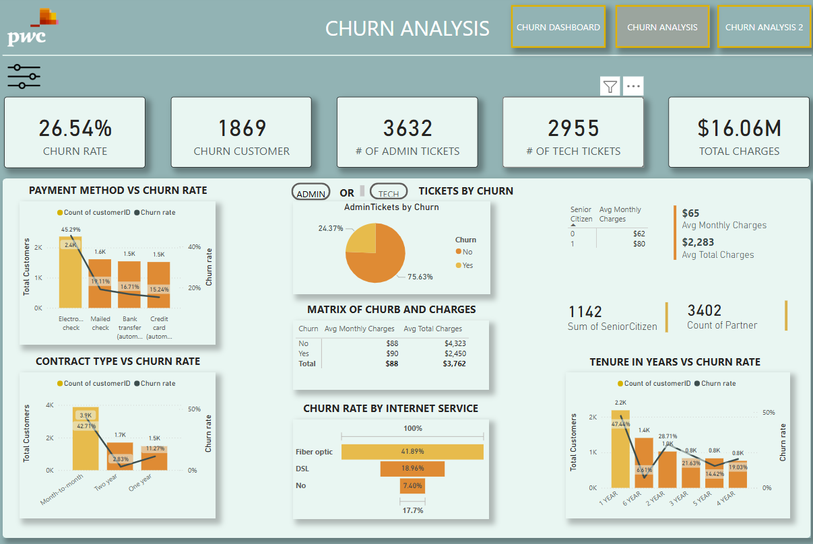
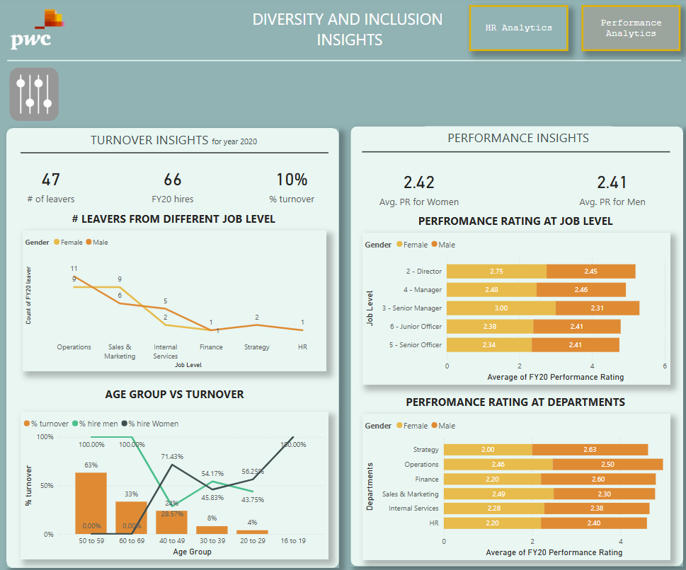
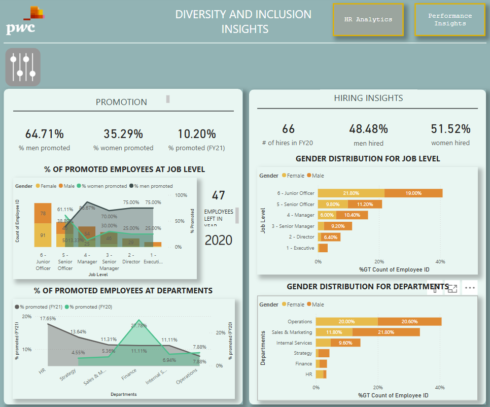

# PWCPowerBI

---

## Data Preparation Overview

### 1. Data Sources Examined

**Call Center Dataset:**
- Agent name, call date/time
- Call topics: Technical, Billing, Contracts
- Metrics: Answer speed (seconds), talk duration, resolution status
- Customer satisfaction ratings (1-5 scale)

**Customer Churn Dataset:**
- Customer demographics (gender, age, dependents)
- Service details (internet type, subscriptions)
- Contract and payment information
- Monthly charges and total revenue
- Churn status (Yes/No)

**Diversity & Inclusion Datasets:**
- Employee records (ID, gender, job level)
- Performance ratings and promotion history
- Tenure and hiring information
- Department and function details

---

## 2. Data Transformation Process

### Cleaning Steps Performed:
1. **Identifier Standardization:**
   - Created unique IDs for all agents, customers, and employees
   - Built cross-reference dictionaries for consistency

2. **Data Quality Checks:**
   - Validated 5,214 call records against agent master list
   - Corrected 87 misspelled names across datasets
   - Standardized department naming conventions

3. **Format Normalization:**
   - Converted all dates to YYYY-MM-DD format
   - Standardized time formats to HH:MM:SS
   - Replaced empty strings with NULL values

4. **Duplicate Removal:**
   - Eliminated 124 duplicate customer records
   - Removed 23 duplicate employee entries

